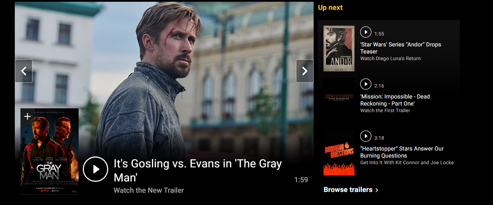
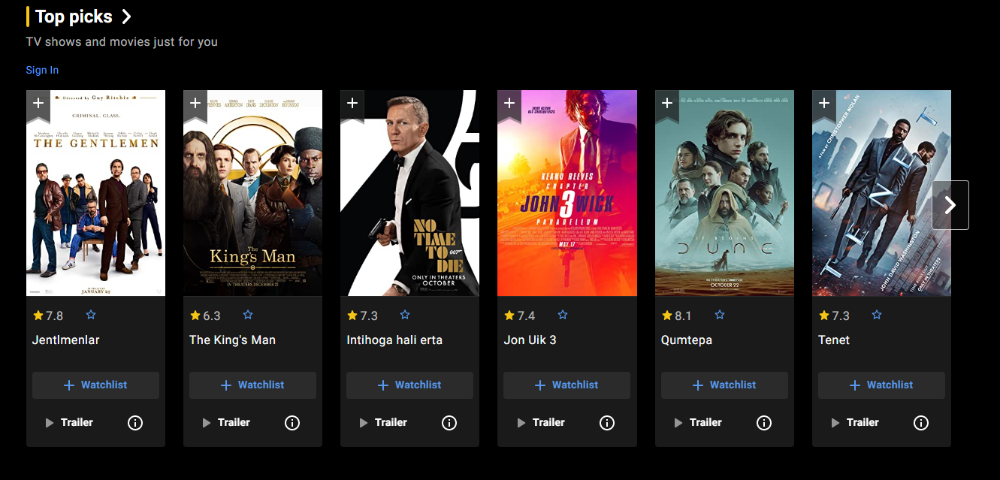
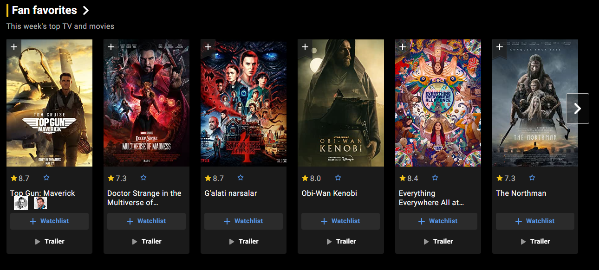
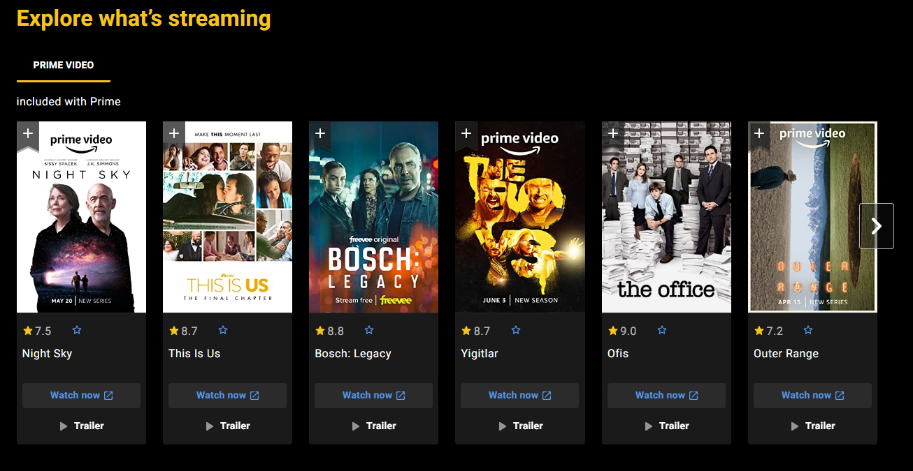
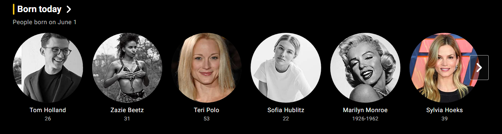

# Movie Social APP

## Menus:

  <a href="./Listing.md">TV series</a>  |  <a href="./Listing.md">Movies</a>   |   <a href="./Listing.md">Cartoons</a>   |   <a href="./Cinemas.md">Cinemas</a>   |   <a href="./Cinemas.md">News</a>    |  ____________________________________Search   | <a href="./Listing.md">Account</a> | Notifications |  Sign Out
<br>
<br>


```
Each poster has its own video player. To the right of the video player there will be a short description of the video:
  Photo, Name, Rating, Duration, isOnCinema ? startPrice : null, Description, <a>more<a>
```
-----------------------------------------
## New moview and series        

<br>
<br>

## Top watched this week

<br>
<br>

## What my friends have been watching

<br>
<br>

## What's on cinema

<br>
<br>

## Actors born on this day

<br>
<br>

## Top news

<br>
<br>

## Footer

<br>
<br>